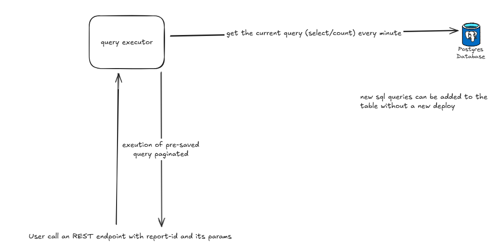

# Dynamic report generator

## Goals
- Have more control over the report generation process by using a dynamic report generator.
- The user pick one id and the report is generated based on the id and its parameters.
- Every minute the report queries are updated with new data.

## TODO
- Handle SQL injection properly. - Done